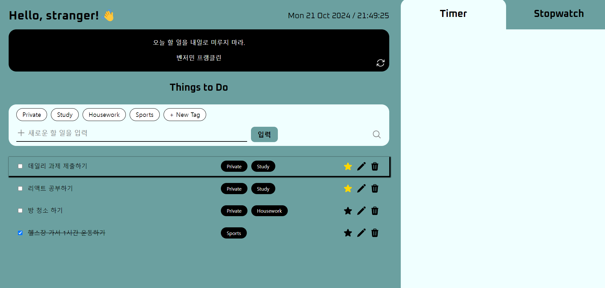

# Todo App

## 데모

## 개발 과정

| 개발일자   | 작업 내용                                         | 비고                                                                               |
| ---------- | ------------------------------------------------- | ---------------------------------------------------------------------------------- |
| 2024-10-21 | 프로젝트 기본 UI 및 Todo CRUD 기능 구현           | 추가 기능(현재 시간, 랜덤 명언 표시)                                               |
| 2024-10-22 | Header 유저명 편집 모드 추가 및 localStorage 저장 | `FormInput`, `SubmitBtn` 스타일 분리                                               |
| 2024-10-25 | TodoForm내 태그 관리 구조 변경                    | 화면에 추가할 태그 리스트(`tags`)와 Todo별 선택한 태그 리스트(`selectedTags`) 분리 |
